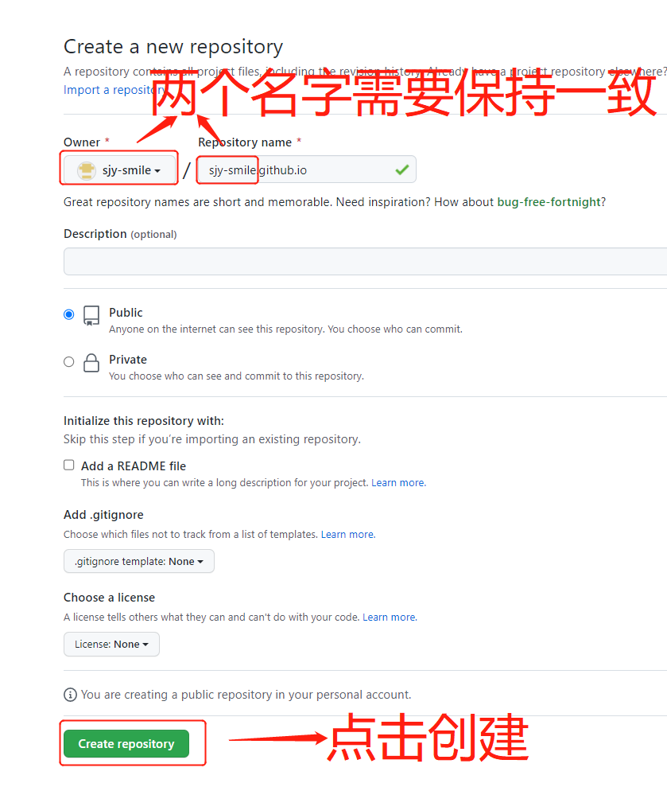

### hexo 从零到一搭建

**系统环境**：windows10系统配置部署

### 前期准备

1、安装 node.js

2、安装 cnpm，并设置淘宝镜像源

命令：`npm install -g cnpm --registry==https://registry.npm.taobao.org`

验证：`cnpm -v`

3、安装 git

官网下载地址： https://git-scm.com/download/win

### 配置 GitHub

1、在 github 上创建仓库

==注意==

- 仓库的格式必须为：username.github.io，其中username 是你的用户名
- Description：为描述仓库（选填）
- 勾选 Initialize this repository with a README 初始化一个 README.md 文件
- 点击 Creat repository 进行创建
- 创建页面如下



2、安装 Hexo

在目标路径打开CMD窗口，输入npm install -g hexo-cli安装Hexo环境

```bash
npm install -g hexo-cli
```

安装完后输入hexo -v验证是否安装成功。

3、初始化项目，打开cmd命令窗口，执行`hexo init`初始化项目

​	  hexo init blog-demo(项目名)

4、启动

```bash
hexo server 或者简写 hexo s
```

本地访问：localhost:4000

5、创建博客、发布、生成访问

```bash
# 创建文章
hexo new "第一篇博客文章"
# 清理重新生成
hexo clean
hexo generate 缩写 hexo g
# 重新启动
hexo s
# 部署
hexo deploy 或者  hexo d
```

目录说明

【node_modules】：依赖包
【scaffolds】：生成文章的一些模板
【source】：用来存放你的文章
【themes】：主题
【.npmignore】：发布时忽略的文件（可忽略）
【_config.landscape.yml】：主题的配置文件
【_config.yml】：博客的配置文件
【package.json】：项目名称、描述、版本、运行和开发等信息

### 部署到GitHub

1、在 hexo 文件夹下安装插件

```bash
npm install --save hexo-deployer-git
```

必须安装，否则执行 hexo d 会报错

2、在 hexo 文件夹下设置 `_config.yml` 文件，在文件末尾添加以下内容

```yaml
# Deployment
## Docs: https://hexo.io/docs/one-command-deployment
deploy:
  type: git
  repository: https://github.com/sjy-smile/sjy-smile.github.io.git
  branch: master
```

3、部署

```bash
hexo deploy 或者  hexo d
```

注意：出现以下错误

```bash
 delete mode 100644 placeholder
fatal: unable to access 'https://github.com/sjy-smile/sjy-smile.github.io.git/': OpenSSL SSL_read: Connection was reset, errno 10054
FATAL Something's wrong. Maybe you can find the solution here: https://hexo.io/docs/troubleshooting.html
Error: Spawn failed
    at ChildProcess.<anonymous> (D:\heox\node_modules\hexo-util\lib\spawn.js:51:21)
    at ChildProcess.emit (events.js:400:28)
    at ChildProcess.cp.emit (D:\heox\node_modules\cross-spawn\lib\enoent.js:34:29)
    at Process.ChildProcess._handle.onexit (internal/child_process.js:277:12)
```

设置 ssl，跳过 ssl 验证

```bash
git config --global http.sslVerify "false"
```

访问：https://sjy-smile.github.io

### SSH配置

### 替换主题

1、查找主题

hexo 官网主题：https://hexo.io/themes/

例如：https://github.com/litten/hexo-theme-yilia.git

2、克隆主题

切换到 hexo 博客文件夹下，使用控制面板打开

```bash
# 常用第一种主题
git clone https://github.com/litten/hexo-theme-yilia.git themes/yilia
# 第二种主题
git clone https://github.com/jerryc127/hexo-theme-butterfly.git themes/butterfly
```

3、应用主题

修改 Hexo 根目录下的 _config.yml，把主题改为butterfly

```yaml
theme: butterfly
```

4、安装插件，渲染主题

```bash
npm install hexo-renderer-pug hexo-renderer-stylus --save
```

重启服务，访问：localhost:4000

==配置文件说明==

```yaml
# 网站标题
title: 博客标题
# 网站副标题
subtitle: ''
# 网站描述
description: ''
# 网站关键词，支持多个关键词，逗号分隔
keywords:
# 作者名字
author: ss
# 语言 例如：en,zh-CN  在主题下的 language 文件夹下
language: en
# 时区，默认使用电脑的时区。请参考 时区列表 进行设置，如 America/New_York, Japan, 和 UTC 。一般的，对于中国大陆地区可以使用 Asia/Shanghai
timezone: Asia/Shanghai

# 设置网站的 url
url: https://xxx.com
# 文章的 永久链接 格式
permalink: :year/:month/:day/:title/
# 永久链接中各部分的默认值
permalink_defaults: null
# 改写 permalink 的值来美化 URL
pretty_urls:
  # 是否在永久链接中保留尾部的 index.html，设置为 false 时去除
  trailing_index: true
  # 是否在永久链接中保留尾部的 .html, 设置为 false 时去除 (对尾部的 index.html无效)
  trailing_html: true

# 目录
# 资源文件夹，这个文件夹用来存放内容
source_dir: source
# 公共文件夹，这个文件夹用于存放生成的站点文件
public_dir: public
# 标签文件夹
tag_dir: tags
# 归档文件夹
archive_dir: archives
# 分类文件夹
category_dir: categories
# Include code 文件夹，source_dir 下的子目录
code_dir: downloads/code
# 国际化（i18n）文件夹
i18n_dir: :lang
# 可以使用 glob 表达式来匹配路径
skip_render: null

# 文章
# 新文章的文件名称
new_post_name: :title.md
# 预设布局
default_layout: post
# 把标题转换为大小写，true 为大写，false为小写
titlecase: false
# 在新标签中打开链接
external_link:
  enable: true
  # 对整个网站（site）生效或仅对文章（post）生效
  field: site
  # 需要排除的域名。主域名和子域名如 www 需分别配置
  exclude: ''
# 把文件名称转换为 (1) 小写或 (2) 大写
filename_case: 0
# 显示草稿
render_drafts: false
# 启动 Asset 文件夹 资源（Asset）代表 source 文件夹中除了文章以外的所有文件，例如图片、CSS、JS 文件等
post_asset_folder: true
# 把链接改为与根目录的相对位址
relative_link: false
# 显示未来的文章
future: true
# 代码块的设置, 可参考 Highlight.js 进行设置
highlight:
  enable: true
  line_number: true
  auto_detect: false
  tab_replace: ''
  wrap: true
  hljs: false
# 代码块的设置, 可参考 PrismJS 进行设置
prismjs:
  enable: false
  preprocess: true
  line_number: true
  tab_replace: ''

index_generator:
  path: ''
  per_page: 10
  order_by: -date

# 分类 & 标签
# 默认分裂
default_category: uncategorized
# 分类别名
category_map:
# 标签别名
tag_map:

# Metadata elements
## https://developer.mozilla.org/en-US/docs/Web/HTML/Element/meta
meta_generator: true

# 日期 时间格式 Hexo 使用 Moment.js 来解析和显示时间
## http://momentjs.com/docs/#/displaying/format/
# 日期格式
date_format: YYYY-MM-DD
# 时间格式
time_format: HH:mm:ss
# 当 Front Matter 中没有指定 updated 时 updated 的取值
# mtime: 使用文件的最后修改时间。这是从 Hexo 3.0.0 开始的默认行为
# date: 使用 date 作为 updated 的值。可被用于 Git 工作流之中，因为使用 Git 管理站点时，文件的最后修改日期常常会发生改变
# empty: 直接删除 updated。使用这一选项可能会导致大部分主题和插件无法正常工作
updated_option: 'mtime'

# 分页 每页显示的文章量 (0 = 关闭分页功能)
per_page: 10
# 分页目录
pagination_dir: page

# 在 Hexo 配置文件中，通过设置 include/exclude 可以让 Hexo 进行处理或忽略某些目录和文件夹。你可以使用 glob 表达式 对目录和文件进行匹配
# Hexo 默认会忽略隐藏文件和文件夹（包括名称以下划线和 . 开头的文件和文件夹，Hexo 的 _posts 和 _data 等目录除外）。通过设置此字段将使 Hexo 处理他们并将它们复制到 source 目录下
include:
# Hexo 会忽略这些文件和目录
exclude:
ignore:

# 主题 值为false时禁用主题
# Themes: https://hexo.io/themes/
theme: butterfly

# 部署分支地址设置
# Docs: https://hexo.io/docs/one-command-deployment
deploy:
  type: git
  repository: https://github.com/sjy-smile/sjy-smile.github.io.git
  branch: master

```

### 绑定域名

1、GitHub 目录下创建一个 `CNAME` 的文件，域名写进去即可，不需要www，例如：xxx.com

注意：这种情况每次部署都会覆盖，需要在 heox 下的 source 文件夹下，新建一个名为 CNAME 的文件，把域名 xxx.com 写入保存重新发布即可

### 页面设置

#### Page Front-matter

Front-matter 是markdown 文件最上方以 --- 分隔的区域，用于指定个别档案的变数。

==如果标注可选的参数，可根据自己需要添加，不用全部都写在markdown里==

```yacas
--- 
title: 
date: 
updated: 
type: 
comments: 
description: 
keywords: 
top _img: 
mathjax: 
katex: 
aside: 
aplayer: 
highlight_ shrink: 
---
```

| 写法             | 解释                                                         |
| ---------------- | ------------------------------------------------------------ |
| title            | 【必需】页面标题                                             |
| date             | 【必需】页面创建日期                                         |
| type             | 【必需】标签、分类和友情链接三个页面需要配置                 |
| updated          | 【可选】页面更新日期                                         |
| description      | 【可选】页面描述                                             |
| keywords         | 【可选】页面关键字                                           |
| comments         | 【可选】显示页面评论模块(默认true)                           |
| top_img          | 【可选】页面顶部图片                                         |
| mathjax          | 【可选】显示mathjax(当设置mathjax的per_page: false时，才需要配置，默认false) |
| katex            | 【可选】显示katex(当设置katex的per_page: false时，才需要配置，默认false) |
| aside            | 【可选】显示侧边栏(默认true)                                 |
| aplayer          | 【可选】在需要的页面加载aplayer的js和css,请参考文章下面的音樂 配置 |
| highlight_shrink | 【可选】配置代码框是否展开(true/false)(默认为设置中highlight_shrink的配置) |

#### Post Front-matter

```yaml
---
title:
date:
updated:
tags:
categories:
keywords:
description:
top_img:
comments:
cover:
toc:
toc_number:
toc_style_simple:
copyright:
copyright_author:
copyright_author_href:
copyright_url:
copyright_info:
mathjax:
katex:
aplayer:
highlight_shrink:
aside:
---
```

| 写法                  | 解释                                                         |
| --------------------- | ------------------------------------------------------------ |
| title                 | 【必需】文章标题                                             |
| date                  | 【必需】文章创建日期                                         |
| updated               | 【可选】文章更新日期                                         |
| tags                  | 【可选】文章标籤                                             |
| categories            | 【可选】文章分类                                             |
| keywords              | 【可选】文章关键字                                           |
| description           | 【可选】文章描述                                             |
| top_img               | 【可选】文章顶部图片                                         |
| cover                 | 【可选】文章缩略图(如果没有设置top_img,文章页顶部将显示缩略图，可设为false/图片地址/留空) |
| comments              | 【可选】显示文章评论模块(默认 true)                          |
| toc                   | 【可选】显示文章TOC(默认为设置中toc的enable配置)             |
| toc_number            | 【可选】显示toc_number(默认为设置中toc的number配置)          |
| toc_style_simple      | 【可选】显示 toc 简洁模式                                    |
| copyright             | 【可选】显示文章版权模块(默认为设置中post_copyright的enable配置) |
| copyright_author      | 【可选】文章版权模块的文章作者                               |
| copyright_author_href | 【可选】文章版权模块的文章作者链接                           |
| copyright_url         | 【可选】文章版权模块的文章连结链接                           |
| copyright_info        | 【可选】文章版权模块的版权声明文字                           |
| mathjax               | 【可选】显示mathjax(当设置mathjax的per_page: false时，才需要配置，默认 false) |
| katex                 | 【可选】显示katex(当设置katex的per_page: false时，才需要配置，默认 false) |
| aplayer               | 【可选】在需要的页面加载aplayer的js和css,请参考文章下面的音乐 配置 |
| highlight_shrink      | 【可选】配置代码框是否展开(true/false)(默认为设置中highlight_shrink的配置) |
| aside                 | 【可选】显示侧边栏 (默认 true)                               |

#### 标签页设置

1. 在 hexo 博客根目录下，使用 cmd 命令窗口执行以下命令

   ```bash
   hexo new page tags
   ```

   会生成一个含有index.md文件的tags文件夹

2. 修改【hexo/source/tags/index.md】，添加type: "tags"

   ```bash
   ---
   title: "标签页"
   date: 2023-02-09 21:42:56
   type: "tags"
   ---
   ```

#### 分类页设置

1. 在 hexo 博客根目录下，使用 cmd 命令窗口执行以下命令

   ```bash
   hexo new page categories
   ```

   在【hexo/source/】会生成一个含有index.md文件的categories文件夹

2. 修改【hexo/source/categories/index.md】，添加type: "categories"

   ```bash
   title: "文章分类"
   date: {{ date }}
   type: "categories"
   ```

#### 404 页面

主題內置了一个简单的404页面，可在设置中开放

本地可访问：http://localhost:4000/404.html

```yaml
# 404页面设置（内置）
error_404:
  enable: true
  subtitle: "页面沒有找到"
  background: https://i.loli.net/2020/05/19/aKOcLiyPl2JQdFD.png
```

#### 插入本地图片

修改主题配置文件`_config.yml`

```yaml
# 配置配置改为true
post_asset_folder: true
```

安装插件

```bash
npm install hexo-asset-image --save
```

在`根目录/source`目录下新建一个`img`文件夹，将使用图片放到里面，例如头像，图标

#### 导航菜单

修改主题配置文件`_config.butterfly.yml`

```yaml
menu:
  Home: / || fas fa-home
  Archives: /archives/ || fas fa-archive
  Tags: /tags/ || fas fa-tags
  Categories: /categories/ || fas fa-folder-open
  List||fas fa-list:
    Music: /music/ || fas fa-music
    Movie: /movies/ || fas fa-video
  Link: /link/ || fas fa-link
  About: /about/ || fas fa-heart
```

- 必须是 `/xxx/`，后面`||`分开，然后写图标名，如果不想显示图标，图标名可不写
- 若主题版本大于 v4.0.0，可以直接在子目录里添加 hide 隐藏子目录，如下面的List

```yaml
menu:
  Home: / || fas fa-home
  Archives: /archives/ || fas fa-archive
  Tags: /tags/ || fas fa-tags
  Categories: /categories/ || fas fa-folder-open
  List||fas fa-list||hide:
   Music: /music/ || fas fa-music
    Movie: /movies/ || fas fa-video
  Link: /link/ || fas fa-link
  About: /about/ || fas fa-heart
```

- 文字可自行更改，中英文都可以

```yaml
menu:
  首页: / || fas fa-home
  时间轴: /archives/ || fas fa-archive
  标签: /tags/ || fas fa-tags
  分类: /categories/ || fas fa-folder-open
  清单||fa fa-heartbeat:
    音乐: /music/ || fas fa-music
    照片: /Gallery/ || fas fa-images
    电影: /movies/ || fas fa-video
  友链: /link/ || fas fa-link
  关于: /about/ || fas fa-heart
```

==注意==：下边友链中 link 需要和友链文件名称保持一致，其他也一样

#### 友情连接页面

创建友情链接页面

1. 在 hexo 博客根目录下，使用 cmd 命令窗口执行以下命令

   ```bash
   hexo new page link
   ```

   在【hexo/source/】会生成一个含有 index.md 文件的 link 文件夹

2. 修改【hexo/source/link/index.md】，添加type: "link"

   ```bash
   title: "友情链接"
   date: {{ date }}
   type: "link"
   ```

3. 友情链接添加友链信息

   在Hexo博客目录中的 【hexo/source/_data】（如果没有 _data 文件夹，请自行创建），創建一個文件 link.yml

   ```yaml
   - class_name: 友情连接
     class_desc: 那些人，那些事
     link_list:
       - name: 师小师博客
         link: https://shijinying.top/
         avatar: https://thirdwx.qlogo.cn/mmopen/vi_32/iclF6ggTvPib1k50Gf0iaeGWloISZ0t3bSWQDSzMiatSsCtiaPc9QcZuOdwZ3qicPKanCTzdUr5VFrDKEmzIMmztLMRg/132
         descr: 愿你尝遍烟火，依然相信，人间值得
   
   - class_name: 网站
     class_desc: 值得推荐的网站
     link_list:
       - name: Youtube
         link: https://www.youtube.com/
         avatar: https://i.loli.net/2020/05/14/9ZkGg8v3azHJfM1.png
         descr: 视频网站
       - name: Weibo
         link: https://www.weibo.com/
         avatar: https://i.loli.net/2020/05/14/TLJBum386vcnI1P.png
         descr: 中國最大社交分享平台
       - name: Twitter
         link: https://twitter.com/
         avatar: https://i.loli.net/2020/05/14/5VyHPQqR6LWF39a.png
         descr: 社交分享平台
   ```

   #### 代码

   1. 代码高亮主题

      Butterfly支持 6 种代码高亮样式：

      - darker
      - pale night
      - light
      - ocean
      - mac
      - mac light

      修改主题配置文件`_config.butterfly.yml`。中的`highlight_theme`属性

      ```yaml
      # 代码高亮主题
      highlight_theme: darker
      ```

   ```
   
   ```

4. 代码复制

   修改主题配置文件`_config.butterfly.yml`中的`highlight_copy`属性，`true`表示可以复制

      ```yaml
      # 代码复制
   highlight_copy: true
      ```

   3. 代码框展开/关闭

      修改主题配置文件`_config.butterfly.yml`。中的`highlight_shrink`属性

      ```yaml
      #代码框不展开，需点击 '>' 打开 true:关闭  false:展开
      highlight_shrink: true
      ```

   ```
      在默认情况下，代码框自动展开，可设置是否所有代码框都关闭状态，点击>可展开代码。
   
   - true 全部代码框不展开，需点击>打开
      - false 代码框展开，有>点击按钮
   - none 不显示>按钮
   ```

5. 代码换行

   在默认情况下，Hexo 在编译的时候不会实现代码自动换行。如果你不希望在代码块的区域里有横向滚动条的话，那么你可以考虑开启这个功能。

      修改主题配置文件`_config.butterfly.yml`。中的`code_word_wrap`属性

   ```yaml
      code_word_wrap: true
   ```

6. 代码高度限制

   可配置代码高度限制，超出的部分会隐藏，并显示展开按钮

   ```yaml
      highlight_height_limit: false # unit: px
   ```

      - 单位是`px`，直接添加数字，如 200，直接写：highlight_height_limit: 200
      - 实际限制高度为`highlight_height_limit + 30 px` ，多增加 30px 限制，目的是避免代码高度只超出highlight_height_limit 一点时，出现展开按钮，展开没内容。
      - 不适用于隐藏后的代码块（ css 设置 `display: none`）。

#### 社交图标

`Butterfly`支持[font-awesome v6](https://fontawesome.com/icons?from=io)图标

书写格式：`图标名：url || 描述性文字`

```yaml
# 社交图标
social:
  # 跳转QQ聊天页面，需要提前权限设置验证方式选择允许任何人
  fa-brands fa-qq: http://wpa.qq.com/msgrd?v=3&uin=897878863&site=qq&menu=yes || QQ
  fa-brands fa-weixin: https://img.shijinying.top/1676018767982.jpg || 微信
  fas fa-envelope: mailto:857205464@qq.com || Email
  fab fa-github: https://github.com/sjy-smile || Github
  fa-brands fa-bilibili: https://space.bilibili.com/419799752 || BILIBILI
  fa-solid fa-rss: https://github.com/sjy-smile/sjy-smile.github.io/issues || RSS
```

#### RSS 订阅生成

1. 下载安装插件

   ```shell
   npm install hexo-generator-feed --save
   ```

2. 添加配置，修改主题配置文件`_config.butterfly.yml`

   ```yaml
   #订阅RSS
   feed:
     type: atom
     path: atom.xml
     limit: false  # 或者只带你显示行数 limit: 100
   ```

3. 配置说明

   - type: RSS的类型(atom/rss2)
   - path: 文件路径，默认是 atom.xml/rss2.xml
   - limit: 展示文章的数量,使用 0 或则 false 代表展示全部
   - hub: URL of the PubSubHubbub hubs (如果使用不到可以为空)
   - content: （可选）设置 true 可以在 RSS 文件中包含文章全部内容，默认：false
   - content_limit: （可选）摘要中使用的帖子内容的默认长度。 仅在内容设置为false且未显示自定义帖子描述时才使用。
   - content_limit_delim: （可选）如果content_limit用于缩短post内容，则仅在此分隔符的最后一次出现时进行剪切，然后才达到字符限制。默认不使用。
   - icon: （可选）自定义订阅图标，默认设置为主配置中指定的图标。
   - order_by: 订阅内容的顺序。 (默认: -date)

4. 添加配置，修改主题配置文件`_config.butterfly.yml`

   ```yaml
   rss: /atom.xml
   ```

5. 重新生成博客静态文件

   ```bash
   hexo clean && hexo generate
   ```

   访问 http://localhost:4000/atom.xml

#### 顶部图

如果不要显示顶部图，可直接配置 `disable_top_img: true`

| 配置             | 解释                                                         |
| ---------------- | ------------------------------------------------------------ |
| index_img        | 主页的 top_img                                               |
| default_top_img  | 默认的 top_img，当页面的 top_img 没有配置时，会显示 default_top_img |
| archive_img      | 归档页面的 top_img                                           |
| tag_img          | tag子页面 的 默认 top_img                                    |
| tag_per_img      | tag子页面的 top_img，可配置每个 tag 的 top_img               |
| category_img     | category 子页面 的 默认 top_img                              |
| category_per_img | category 子页面的 top_img，可配置每个 category 的 top_img    |

修改配置文件

==注意：==如果需要使用博客下的静态文件，需要在根目录的 source 文件夹下创建静态文件夹，例如：`img` 引用 /img/aa.jpg

```yaml
# 顶部图 不显示顶部图:true，显示顶部图:false
disable_top_img: false
# 主页的 top_img
index_img: https://oss.aliyuncs.com/aliyun_id_photo_bucket/default_handsome.jpg
# 默认的 top_img，当页面的 top_img 没有配置时，会显示 default_top_img
default_top_img: https://oss.aliyuncs.com/aliyun_id_photo_bucket/default_handsome.jpg
# 归档页面的 top_img
archive_img: https://oss.aliyuncs.com/aliyun_id_photo_bucket/default_handsome.jpg
# tag子页面 的 默认 top_img
tag_img: https://oss.aliyuncs.com/aliyun_id_photo_bucket/default_handsome.jpg
# tag子页面的 top_img，可配置每个 tag 的 top_img
tag_per_img: https://oss.aliyuncs.com/aliyun_id_photo_bucket/default_handsome.jpg
# category 子页面 的 默认 top_img
category_img: https://oss.aliyuncs.com/aliyun_id_photo_bucket/default_handsome.jpg
# category 子页面的 top_img，可配置每个 category 的 top_img
category_per_img: https://oss.aliyuncs.com/aliyun_id_photo_bucket/default_handsome.jpg
```

#### 博客首页 图片遮罩层

在文件 `themes\butterfly\source\css\_layout\head.styl` 第14行，修改 `background-color: alpha($dark-black, .3)`  为 `background-color: alpha($dark-black, .0)`

注意：新版本 4.12.0，修改文件 `theme\butterfly\source\css\_global\index.styl` 中属性 `--mark-bg: alpha($dark-black, .3)`

#### 主页top_img显示大小

默认的显示为全屏。site-info的区域会居中显示

```yaml
# 主页设置
# 默认top_img全屏，site_info在中间
# 使用默认, 都无需填写（建议默认）
index_site_info_top: # 主页标题距离顶部距离  例如 300px/300em/300rem/10%
index_top_img_height:  #主页top_img高度 例如 300px/300em/300rem  不能使用百分比
```

注意：index_top_img_height的值不能使用百分比，2个都不填的话，会使用默认值

#### 网站图标

```yaml
# 网站图标
favicon: /img/favicon.jpg # 直接地址也可以
```

#### 导航栏

```yaml
# 导航栏 
nav:
  # 网站标题icon
  # logo: https://thirdwx.qlogo.cn/mmopen/vi_32/iclF6ggTvPib1k50Gf0iaeGWloISZ0t3bSWQDSzMiatSsCtiaPc9QcZuOdwZ3qicPKanCTzdUr5VFrDKEmzIMmztLMRg/132 #image 直接写图片连接地址
  # 是否显示网站标题，填写 true 或者 false
  display_title: true
  # 导航栏是否固定位置，填写 true 或者 false
  fixed: true # fixed navigation bar
```

#### 头像

```yaml
# 头像
avatar:
  img: /img/head.jpg
  effect: false # true则会一直转圈
```

#### 文章置顶与封面

1. 你可以直接在文章的`front-matter`区域里添加`sticky: 1`属性来把这篇文章置顶。数值越大，置顶的优先级越大。

2. 文章的markdown文档上，在`Front-matter`添加`cover`，并填上要显示的图片地址。如果不配置`cover`，可以设置显示默认的`cover`；如果不想在首页显示cover，可以设置为`false`。
   修改主题配置文件`_config.butterfly.yml`。

   ```yaml
   cover:
     # 是否显示文章封面
     index_enable: true
     aside_enable: true
     archives_enable: true
     # 封面显示的位置
     # 三个值可配置 left , right , both
     position: both
     # 当没有设置cover时，默认的封面显示
     default_cover: 
   ```

   当配置多张图片时，会随机选择一张作为cover，此时写法应为：

   ```yaml
   default_cover:
     - https://oss.aliyuncs.com/aliyun_id_photo_bucket/default_handsome.jpg
     - https://oss.aliyuncs.com/aliyun_id_photo_bucket/default_handsome.jpg
     - https://oss.aliyuncs.com/aliyun_id_photo_bucket/default_handsome.jpg
   ```

#### Hexo文章链接问题

hexo 默认文章链接配置 `permalink: :year/:month/:day/:title/`  ，这种默认配置有个很不能接受的缺点，文件名为中文，会导致url链接里面出现中文

使用 `hexo-abbrlink` 插件解决方案，随街生成

1. 安装 `hexo-abbrlink` 插件

   ```bash
   npm install hexo-abbrlink --save
   ```

2. 修改主题配置文件 ``_config.yml`

   ```yaml
   # 添加 abbrlink 配置
   abbrlink:
     alg: crc32  # 算法：crc16(default) and crc32
     rep: hex    # 进制：dec(default) and hex
   # 修改文章链接地址配置
   permalink: posts/:abbrlink.html
   ```

### 博客增加动画（首页打开懒加载）

在 hexo 文件夹下执行以下命令

```bash
npm install hexo-butterfly-wowjs --save
```

修改主题配置文件 `_config.butterfly.yml` ，添加一下内容

```bash
wowjs:
  enable: true #控制动画开关。true是打开，false是关闭
  priority: 10 #过滤器优先级
  mobile: false #移动端是否启用，默认移动端禁用
  animateitem:
    - class: recent-post-item #必填项，需要添加动画的元素的class
      style: animate__zoomIn #必填项，需要添加的动画
      duration: 2s #选填项，动画持续时间，单位可以是ms也可以是s。例如3s，700ms。
      delay: 1s #选填项，动画开始的延迟时间，单位可以是ms也可以是s。例如3s，700ms。
      offset: 100 #选填项，开始动画的距离（相对浏览器底部）
      iteration: 2 #选填项，动画重复的次数
    - class: card-widget
      style: animate__zoomIn
  animate_css: https://npm.elemecdn.com/hexo-butterfly-wowjs/lib/animate.min.css
  wow_js: https://npm.elemecdn.com/hexo-butterfly-wowjs/lib/wow.min.js
  wow_init_js: https://npm.elemecdn.com/hexo-butterfly-wowjs/lib/wow_init.js
```

### 主题按钮特效相关配置

1. 文章meta显示

   `post_meta`这个属性用于显示文章的相关信息的，修改主题配置文件`_config.butterfly.yml`

   ```yaml
   post_meta:
     page:
       date_type: both # created or updated or both 主页文章日期是创建日或者更新日或都显示
       date_format: relative # date/relative 显示日期还是相对日期
       categories: true # true or false 主页是否显示分类
       tags: true # true or false 主页是否显示标签
       label: true # true or false 显示描述性文字
     post:
       date_type: both # created or updated or both 文章页日期是创建日或者更新日或都显示
       date_format: relative # date/relative 显示日期还是相对日期
       categories: true # true or false 文章页是否显示分类
       tags: true # true or false 文章页是否显示标签
       label: true # true or false 显示描述性文字
   ```

2. 文章版权和许可协议

   修改主题配置文件`_config.butterfly.yml`

   ```yaml
   post_copyright:
     enable: true
     decode: true
     author_href:
     license: CC BY-NC-SA 4.0
     license_url: https://creativecommons.org/licenses/by-nc-sa/4.0/
   ```

   由于`Hexo 4.1`开始，默认对网址进行解码，以至于如果是中文网址，会被解码，可设置`decode: true`来显示中文网址。如果有文章（例如：转载文章）不需要显示版权，可以在文章页`Front-matter`中单独设置

   ```yaml
   copyright: false
   ```

   从`v3.0.0`开始，支持对单独文章设置版权信息，可以在文章Front-matter单独设置

   ```yaml
   post_copyright:
   copyright_author: xxxx
   copyright_author_href: https://xxxxxx.com
   copyright_url: https://xxxxxx.com
   copyright_info: 此文章版权归xxxxx所有，如有转载，请註明来自原作者
   ```

3. 文章打赏

   修改主题配置文件`_config.butterfly.yml`

   ```yaml
   # 文章打赏
   reward:
     enable: true
     QR_code:
       - img: /img/wechat.jpg
         link:
         text: 微信
       - img: /img/wechat.jpg
         link:
         text: 支付宝
   ```

4. 文章目录 TOC

   修改主题配置文件`_config.butterfly.yml`

   ```yaml
   toc:
     post: true # 文章页是否显示 TOC
     page: false # 普通页面是否显示 TOC
     number: true # 是否显示章节数
     expand: false # 是否展开 TOC
     style_simple: false # for post 简洁模式（侧边栏只显示 TOC, 只对文章页有效 ）
   ```

5. 相关文章推荐

   相关文章推荐的原理是根据文章tags的比重来推荐，修改主题配置文件`_config.butterfly.yml`

   ```yaml
   # 相关文章推荐
   related_post:
     enable: true
     limit: 6 # 显示推荐文章数目
     date_type: created # or created or updated 文章日期显示创建日或者更新日
   ```

6. 文章锚点

   开启文章锚点后，当你在文章页进行滚动时，文章链接会根据标题ID进行替换。

   注意: 每替换一次，会留下一个历史记录。所以如果一篇文章有很多锚点的话，网页的历史记录会很多。

   修改主题配置文件`_config.butterfly.yml`

   ```yaml
   # 文章锚点
   anchor: true
   ```

7. 文章过期提醒

   可设置是否显示文章过期提醒，以更新时间为基准。

   ```yaml
   # 文章过期提醒
   noticeOutdate:
     enable: true
     style: flat # style: simple/flat
     limit_day: 365 # 距离更新时间多少天才显示文章过期提醒
     position: top # position: top/bottom
     message_prev: It has been # 天数之前的文字
     message_next: days since the last update, the content of the article may be outdated. # 天数之后的文字
   ```

8. 文章分页按钮

   修改主题配置文件`_config.butterfly.yml`

   ```yaml
   # post_pagination (分页)
   # value: 1 || 2 || false	# false:为关闭分页按钮；1:下一篇显示的是旧文章；2:下一篇显示的是新文章
   # 1: The 'next post' will link to old post
   # 2: The 'next post' will link to new post
   # false: disable pagination
   post_pagination: false
   ```

#### 文章内容复制相关配置

```yaml
# copy settings
# copyright: Add the copyright information after copied content (复制的内容后面加上版权信息)
copy:
  enable: true	# 是否开启网站复制权限
  copyright:	# 复制的内容后面加上版权信息
    enable: true	# 是否开启复制版权信息添加
    limit_count: 50	# 字数限制，当复制文字大于这个字数限制时，将在复制的内容后面加上版权信息
```

#### Footer 设置

1. 修改主题配置文件`_config.butterfly.yml`

   ```yaml
   # Footer 设置
   footer:
     owner:
       enable: true
       since: 2023	# 站点起始时间
     custom_text:	# 是一个给你用来在页脚自定义文本的选项。通常你可以在这里写声明文本等,支持 HTML。
     copyright: false # Copyright of theme and framework
   ```

   例如

   ```yaml
   custom_text: I wish you to become your own sun, no need to rely on who's light.<p><a target="_blank" href="https://hexo.io/"></a>&nbsp;<a target="_blank" href="https://butterfly.js.org/"></a>&nbsp;<a target="_blank" href="https://www.jsdelivr.com/"></a> &nbsp;<a arget="_blank" href="https://beian.miit.gov.cn/shouye.html"></a>&nbsp;<a target="_blank" href="https://vercel.com/ "></a>&nbsp;<a target="_blank" href="https://vercel.com/ "></a>&nbsp;<a target="_blank" href="https://github.com/"></a>&nbsp;<a target="_blank" href="http://creativecommons.org/licenses/by-nc-sa/4.0/"></a></p>
   ```

   对于部分人需要写 ICP 的，也可以写在custom_text里

   ```yaml
   custom_text: <a href="icp链接"><span>备案号：xxxxxx</span></a>
   ```

#### 右下加按钮

1. 简繁转换

   修改主题配置文件`_config.butterfly.yml`

   ```yaml
   # 简繁切换
   translate:
     enable: true
     # 默认按钮显示文字(网站是简体，应设置为'default: 繁')
     default: 繁
     # the language of website (1 - Traditional Chinese/ 2 - Simplified Chinese）
     # 网站默认语言，1: 繁体中文, 2: 简体中文
     defaultEncoding: 2
     # Time delay 延迟时间,若不在前, 要设定延迟翻译时间, 如100表示100ms,默认为0
     translateDelay: 0
     # 当文字是简体时，按钮显示的文字
     msgToTraditionalChinese: '繁'
     # 当文字是繁体时，按钮显示的文字
     msgToSimplifiedChinese: '簡'
   ```

2. 滚动状态百分比

   主题配置文件中

   ```yaml
   # 顶部箭头滚动状态百分比显示
   rightside_scroll_percent: true
   ```

#### 夜间模式

修改主题配置文件`_config.butterfly.yml`

```yaml
# 夜间模式
darkmode:
  enable: true
  # dark 和 light 两种模式切换按钮
  button: true
  # Switch dark/light mode automatically (自动切换 dark mode和 light mode)
  # autoChangeMode: 1  Following System Settings, if the system doesn't support dark mode, it will switch dark mode between 6 pm to 6 am
  # autoChangeMode: 2  Switch dark mode between 6 pm to 6 am
  # autoChangeMode: false
  autoChangeMode: 2
```

v2.0.0 开始增加一个选项，可开启自动切换light mode 和 dark mode。

- `autoChangeMode: 1` 跟随系统而变化，不支持的浏览器/系统将按照时间晚上6点到早上6点之间切换为 dark mode。
- `autoChangeMode: 2`只按照时间 晚上6点到早上6点之间切换为 dark mode,其余时间为light mode。
- `autoChangeMode: false` 取消自动切换。

#### 阅读模式

阅读模式下会去掉除文章外的内容，避免干扰阅读。只会出现在文章页面，右下角会有阅读模式按钮。

修改主题配置文件`_config.butterfly.yml`

```yaml
readmode: true
```

注意：阅读模式按钮不显示，在路径 `themes\butterfly\layout\includes\rightside.pug` 文件，删除 `rightsied.pug`  readmode 第一行相关代码即可，如：if is_post() && readmode

#### 排序按钮

```yaml
# 按钮排序
rightside_item_order:
  enable: true
  hide: readmode,translate,darkmode,hideAside
  show: # toc,chat,comment
```

#### 侧边栏设置

1. 排版

   可自行决定哪个项目需要显示，可决定位置，也可以设置不显示侧边栏。

   修改主题配置文件`_config.butterfly.yml`，可参考以下配置项

   ```yaml
   aside:
     enable: true
     hide: false
     button: true
     mobile: true # display on mobile
     position: right # left or right
     display:
       archive: true
       tag: true
       category: true
     # 个人简介
     card_author:
       enable: true
       description:
       button:
         enable: true
         icon: fab fa-github
         text: 跳转 Github
         link: https://github.com/sjy-smile
     # 公告配置
     card_announcement:
       enable: true
       content: <center>主域名：<br><a href="https://www.fomal.cc"><b><font color="#5ea6e5">fomal.cc</font></b></a>&nbsp;|&nbsp;<a href="https://www.fomal.cn"><b><font color="#5ea6e5">fomal.cn</font></b></a><br>备用域名：<br><a href="https://blog.fomal.cc"><b><font color="#5ea6e5">blog.fomal.cc</font></b></a><br><a href="https://aa.fomal.cc"><b><font color="#5ea6e5">aa.fomal.cc</font></b></a><br><a href="https://bb.fomal.cc"><b><font color="#5ea6e5">bb.fomal.cc</font></b></a><br><a href="mailto:admin@fomal.cn">📬：<b><font color="#a591e0">admin@fomal.cn</font></b></a></center>
     # 最新文章
     card_recent_post:
       enable: true
       limit: 3 # if set 0 will show all
       sort: date # date or updated
       sort_order: # Don't modify the setting unless you know how it works
     # 文章分类
     card_categories:
       enable: true
       limit: 8 # if set 0 will show all
       expand: false # none/true/false
       sort_order: # Don't modify the setting unless you know how it works
     # 标签
     card_tags:
       enable: true
       limit: 20 # if set 0 will show all
       color: true
       sort_order: # Don't modify the setting unless you know how it works
     # 归档
     card_archives:
       enable: true
       type: monthly # yearly or monthly
       format: MMMM YYYY # eg: YYYY年MM月
       order: -1 # Sort of order. 1, asc for ascending; -1, desc for descending
       limit: 8 # if set 0 will show all
       sort_order: # Don't modify the setting unless you know how it works
     # 网站访问信息
     card_webinfo:
       enable: true
       post_count: true
       last_push_date: true
       sort_order: # Don't modify the setting unless you know how it works
     card_weibo:
       enable: true
   ```

2. 访问人数(UV 和 PV)

   修改主题配置文件`_config.butterfly.yml`

   ```yaml
   # 访问人数
   busuanzi:
     site_uv: true  # 本站总访客数
     site_pv: true  # 本站总访问量 
     page_pv: true  # 本文总阅读量
   ```

3. 运行时间

   修改主题配置文件`_config.butterfly.yml`

   ```yaml
   # Time difference between publish date and now (网页运行时间)
   # Formal: Month/Day/Year Time or Year/Month/Day Time
   runtimeshow:
     enable: true
     publish_date: 10/2/2023 00:00:00
     ##网页开通时间
     #格式: 月/日/年 时间
     #也可以写成 年/月/日 时间
   ```

4. 最新评论

   参考地址：https://blog.51cto.com/u_13734369/5574676

   参考地址：https://www.freesion.com/article/5812549255/

   基于不同插件的评论功能，自行选择

   `v3.1.0` 以上支持。如果未配置任何评论，前先不要开启该功能

   最新评论只会在刷新时才会去读取，并不会实时变化。
   由于 API 有 访问次数限制，为了避免调用太多，主题默认存取期限为 10 分钟。也就是说，调用后资料会存在 `localStorage` 里，10分钟内刷新网站只会去 `localStorage` 读取资料。 10 分钟期限一过，刷新页面时才会去调取 API 读取新的数据。（3.6.0 新增了 storage 配置，可自行配置缓存时间）。

   修改主题配置文件`_config.butterfly.yml`

   ```yaml
   # 最新评论
   newest_comments:
     enable: true
     sort_order: # Don't modify the setting unless you know how it works
     limit: 6  # 显示的数量
     storage: 10 # 设置缓存时间，单位 分钟 
     avatar: true # 是否显示头像
   ```

#### 网站背景

修改主题配置文件`_config.butterfly.yml`

```yaml
# 图片格式 url(http://xxxxxx.com/xxx.jpg)
# 颜色（HEX值/RGB值/颜色单词/渐变色)
# 留空 不显示背景
background: url(http://xxxxxx.com/xxx.jpg)
```

如果你的网站根目录不是`'/'`，使用本地图片时，需加上你的根目录。
例如：网站是 `https://yoursite.com/blog`，引用一张`img/xx.png`图片，则设置`background`为 `url(/blog/img/xx.png)`

#### Head 灰色蒙版

在主题 `/themes/xxx/source/css/_layout/head.styl` 下修改 `&:not(.not-top-img):before` 背景色修改数字 0

#### 打字效果

打字效果[activate-power-mode](https://github.com/disjukr/activate-power-mode)

修改主题配置文件`_config.butterfly.yml`

```yaml
# Typewriter Effect (打字效果)
# https://github.com/disjukr/activate-power-mode
activate_power_mode:
  enable: true
  colorful: true # open particle animation (冒光特效)
  shake: false #  open shake (抖动特效)
  mobile: false
```

#### footer 背景

修改主题配置文件`_config.butterfly.yml`

```yaml
# footer是否显示图片背景(与top_img一致)
footer_bg: true
```

- `留空/false`：显示默认的颜色
- `图片链接`：显示所配置的图片
- `颜色包括HEX值 - #0000FF | RGB值 - rgb(0,0,255) | 颜色单词 - orange | 渐变色 - linear-gradient( 135deg, #E2B0FF 10%, #9F44D3 100%)`：对应的颜色
- `true`：显示跟 top_img 一样

#### 背景特效

1. 静止彩带

   好看的彩带背景，可设置每次刷新更换彩带，或者每次点击更换彩带
   修改 主题配置文件

   ```yaml
   # 背景特效
   canvas_ribbon:
     enable: true
     size: 100
     alpha: 0.6 # 透明度
     zIndex: -1
     click_to_change: false  #设置是否每次点击都更换綵带
     mobile: true # false 手机端不显示 true 手机端显示
   ```

2. 动态彩带

   好看的彩带背景，会飘动，修改主题配置文件`_config.butterfly.yml`

   ```yaml
   canvas_fluttering_ribbon:
     enable: true
     mobile: false # false 手机端不显示 true 手机端显示
   ```

3. canvas_nest

   修改主题配置文件`_config.butterfly.yml`

   ```yaml
   canvas_nest:
     enable: true
     color: '0,0,255' #color of lines, default: '0,0,0'; RGB values: (R,G,B).(note: use ',' to separate.)
     opacity: 0.7 # the opacity of line (0~1), default: 0.5.
     zIndex: -1 # z-index property of the background, default: -1.
     count: 99 # the number of lines, default: 99.
     mobile: false # false 手机端不显示 true 手机端显示
   ```

#### 鼠标点击效果

1. 烟花

   `zIndex`建议只在`-1`和`9999`上选。
   `-1` 代表烟火效果在底部。
   `9999` 代表烟火效果在前面。

   修改主题配置文件`_config.butterfly.yml`

   ```yaml
   fireworks:
     enable: true
     zIndex: 9999 # -1 or 9999
     mobile: false
   ```

2. 爱心

   修改主题配置文件`_config.butterfly.yml`

   ```yaml
   # 点击出现爱心
   click_heart:
     enable: true
     mobile: false
   ```

3. 文字

   修改主题配置文件`_config.butterfly.yml`

   ```yaml
   # 点击出现文字，文字可自行修改
   ClickShowText:
     enable: false
     text:
       - I
       - LOVE
       - YOU
     fontSize: 15px
     random: false # 文字随机显示
     mobile: false
   ```

#### 自定义字体和字体大小

- 全局字体

  修改主题配置文件`_config.butterfly.yml`中的`font-family`属性即可，如不需要配置，留空即可

  ```yaml
  # Global font settings
  # Don't modify the following settings unless you know how they work (非必要不要修改)
  font:
    global-font-size: '15px'
    code-font-size: '14px'
    # -apple-system, BlinkMacSystemFont, "Segoe UI" , "Helvetica Neue" , Lato, Roboto, "PingFang SC" , "Microsoft JhengHei" , "Microsoft YaHei" , sans-serif
    # Wenkai, consolas, -apple-system, 'Quicksand', 'Nimbus Roman No9 L', 'PingFang SC', 'Hiragino Sans GB', 'Noto Serif SC', 'Microsoft Yahei', 'WenQuanYi Micro Hei', 'ST Heiti', sans-serif;
    font-family: var(--global-font), Consolas_1, -apple-system, 'Quicksand', 'Nimbus Roman No9 L', 'PingFang SC', 'Hiragino Sans GB', 'Noto Serif SC', 'Microsoft Yahei', 'WenQuanYi Micro Hei', 'ST Heiti', sans-serif;
    # consolas, ZhuZiAWan_light, "Microsoft YaHei", Menlo, "PingFang SC", "Microsoft JhengHei", sans-serif
    # Consolas_1, ZhuZiAWan_light, "Microsoft YaHei", Menlo, "PingFang SC", "Microsoft JhengHei", sans-serif
    code-font-family: Consolas_1, var(--global-font), "Microsoft YaHei", Menlo, "PingFang SC", "Microsoft JhengHei", sans-serif
  ```

- Blog 标题字体

  修改主题配置文件`_config.butterfly.yml`中的`blog_title_font`属性即可，如不需要配置，请留空
  如不需要使用网络字体，只需要把font_link留空就行

  ```yaml
  # Font settings for the site title and site subtitle
  # 左上角网站名字 主页居中网站名字
  blog_title_font:
    font_link: https://fonts.googleapis.com/css?family=Titillium+Web&display=swap
    font-family: Titillium Web, 'PingFang SC', 'Hiragino Sans GB', 'Microsoft JhengHei', 'Microsoft YaHei', sans-serif
  ```

#### 网站副标题

可设置主页中显示的网站副标题或者喜欢的座右铭。

修改主题配置文件`_config.butterfly.yml`中的`subtitle`

```yaml
# 主页网站副标题
subtitle:
  enable: true
  # Typewriter Effect (打字效果)
  effect: true
  startDelay: 300 # time before typing starts in milliseconds
  typeSpeed: 150 # type speed in milliseconds
  backSpeed: 50 # backspacing speed in milliseconds
  # loop (循环打字)
  loop: true
  # source 调用第三方服务
  # source: false 关闭调用
  # source: 1  调用一言网的一句话（简体） https://hitokoto.cn/
  # source: 2  调用一句网（简体） http://yijuzhan.com/
  # source: 3  调用今日诗词（简体） https://www.jinrishici.com/
  # subtitle 会先显示 source , 再显示 sub 的内容
  source: false
  # 如果关闭打字效果，subtitle 只会显示 sub 的第一行文字
  sub:
   - 昨夜星辰昨夜风，画楼西畔桂堂东。
   - 须知少时拏云志，曾许人间第一流。
   - 夫天地者，万物之逆旅也；光阴者，百代之过客也。
   - 自信人生二百年，会当水击三千里。
```

#### 页面加载动画preloader

当进入网页时，因为加载速度的问题，可能会导致top_img图片出现断层显示，或者网页加载不全而出现等待时间，开启preloader后，会显示加载动画，等页面加载完，加载动画会消失。

```yaml
# 加载动画 Loading Animation
preloader: 
  enable: true
  # source
  # 1. fullpage-loading
  # 2. pace (progress bar)
  source: 1
  # pace theme (see https://codebyzach.github.io/pace/)
  pace_css_url:
```

#### 字数统计

> 注意：必须要安装依赖才能设置为`true`，否则会报错！

1. 安装插件：在你的博客根目录，打开cmd命令窗口执行`npm install hexo-wordcount --save`。

2. 开启配置：修改主题配置文件`_config.butterfly.yml`中的`wordcount`。

   ```yaml
   # 字数统计
   wordcount:
     enable: true
     post_wordcount: true
     min2read: true
     total_wordcount: true
   ```

#### 图片大图查看模式

只能开启一个。
如果你并不想为某张图片添加大图查看模式，你可以使用 html 格式引用图片，并为图片添加 no-lightbox class 名，例如：``

1. fancybox（推荐）

   修改主题配置文件`_config.butterfly.yml`中`fancybox`属性

   ```yaml
   # fancybox http://fancyapps.com/fancybox/3/
   fancybox: true
   ```

2. medium_zoom

   修改主题配置文件`_config.butterfly.yml`中`medium_zoom`属性

   ```yaml
   medium_zoom: true
   ```

#### Snackbar 弹窗

Snackbar 弹窗，根据自己爱好开启，修改主题配置文件`_config.butterfly.yml`

```yaml
# Snackbar 弹窗
# https://github.com/polonel/SnackBar
# position 弹窗位置
# 可选 top-left / top-center / top-right / bottom-left / bottom-center / bottom-right
snackbar:
  enable: true
  position: bottom-left
  bg_light: '#49b1f5' #light mode时弹窗背景
  bg_dark: '#2d3035' #dark mode时弹窗背景
```

#### 顶部图设置透明色

这个是 [Butterfly](https://butterfly.js.org/) 自带的功能，修改主题的配置文件 `_config.butterfly.yml`。

1. 编辑 `index_img`、`background`、`footer_bg` 选项。设置网站背景，并将主页顶部图和页脚背景改为透明

   ```yaml
   # 主页顶部图 top_img 设置
   index_img: transparent
   
   # 设置网站背景(可设置图片或者颜色) url(http://xxxxxx.com/xxx.jpg)，url(/img/index.jpg)
   background: url(https://example.com/img/background.jpg)
   
   # 页脚设置
   footer_bg: transparent
   ```

2. 引入相关样式

   在 `source`目录下 新建一个文件，位于 `source/css/modify.styl`，并增加以下内容

   ```stylus
   @import 'nib'
   
   // 顶部图
   #page-header
     &, &:before
       background: transparent !important
     &.post-bg, &.not-home-page
       height: 280px !important
     #post-info
       bottom: 40px !important
     #page-site-info
       top: 140px !important
   
     @media screen and (max-width: 768px)
       &.not-home-page
         height: 200px !important
       #post-info
         bottom: 10px !important
       #page-site-info
         top: 100px !important
   
   .top-img
     height: 250px
     margin: -50px -40px 50px
     border-top-left-radius: inherit
     border-top-right-radius: inherit
     background-position: center center
     background-size: cover
     transition: all 0.3s
   
     @media screen and (max-width: 768px)
       height: 230px
       margin: -36px -14px 36px
   
     [data-theme='dark'] &
       filter: brightness(0.8)
   
   // 页脚
   #footer:before
     background-color: alpha(#FFF, .5)
   
     [data-theme='dark'] &
       background-color: alpha(#000, .5)
   
   #footer-wrap, #footer-wrap a
     color: #111
     transition: unset
   
     [data-theme='dark'] &
       color: var(--light-grey)
   ```

   在主题配置文件 `_config.butterfly.yml` 的 `inject.head` 引入样式

   ```yaml
   # 插入代码到头部 </head> 之前 和 底部 </body> 之前
   inject:
     head:
       - <link rel="stylesheet" href="/css/modify.css">
   ```

   modify.styl` 会被 Hexo 渲染成 `modify.css` 文件，所以此处应为 `modify.css

3. 增加插件脚本

   因为使用了 `cheerio` 来解析 HTML，所以需要先安装此依赖

   ```bash
   npm install cheerio
   ```

   在 `source`目录下 新建一个文件，位于 `scripts/modify.js`，并增加以下内容

   ```js
   'use strict';
   const cheerio = require('cheerio');
   
   /**
    * 在页面插入新顶部图
    * @param {cheerio.Root} $ Root
    */
   function insertTopImg($) {
       let header = $('#page-header');
       if (header.length === 0) return;
       let background = header.css('background-image');
       if (!background) return;
       $('#post, #page, #archive, #tag, #category').prepend(`<div class="top-img" style="background-image: ${background};"></div>`);
   }
   
   hexo.extend.filter.register('after_render:html', function(str, data) {
       let $ = cheerio.load(str, {
           decodeEntities: false
       });
       insertTopImg($);
       return $.html();
   });
   ```

重启服务 `hexo serve` 即可

#### 本地搜索系统

1. 安装依赖：前往博客根目录，打开cmd命令窗口执行`npm install hexo-generator-search --save`

   ```bash
   npm install hexo-generator-search --save
   ```

2. 注入配置：修改站点配置文件`_config.yml`，添加如下代码

   ```yaml
   search:
     path: search.xml
     field: post
     content: true
   ```

3. 主题中开启搜索：在主题配置文件_config.butterfly.yml中修改以下内容

   ```yaml
   local_search:
   #  enable: false
     enable: true
   ```

4. 重新编译运行，即可看到效果：前往博客根目录，打开cmd命令窗口依次执行如下命令

   ```bash
   hexo cl && hexo generate
   hexo serve
   ```


参考链接

官网：https://butterfly.js.org/posts/4aa8abbe/#flink

https://fe32.top/

https://zsyyblog.com/

https://www.fomal.cc/


